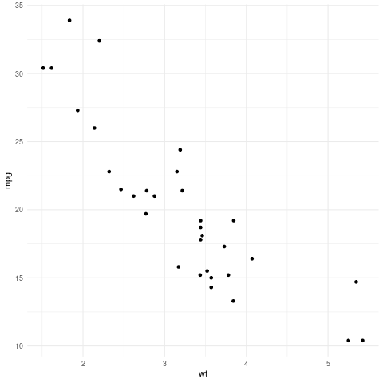

:PROPERTIES:
:ID:       108e07eb-0cbb-4ea2-b4f3-564cd9a7767e
:END:
#+title: Integrando /R/, /tidyverse/ e /ggplot2/ ao Emacs+org-mode
#+author: n-rosenthal
#+date: \date

* Instalando /ESS/
/ESS/ (/Emacs Speaks Statistics/) é um /add-on/ para Emacs que permite suporte de /scripts/ e interação com R e SAS. A instalação pode ser encontrada na documentação no [[https://ess.r-project.org/index.php?Section=download][site]], mas é transcrita abaixo por praticidade.

** Installing from source
Stable versions of ESS are available at the ESS web page as a .tgz file or .zip file. ESS releases are GPG-signed, you should check the signature by downloading the accompanying .sig file and doing:

#+BEGIN_SRC bash
gpg --verify ess-18.10.tgz.sig
#+END_SRC

Alternatively, you may download the git repository. ESS is currently hosted on GitHub: https://github.com/emacs-ess/ESS. git clone https://github.com/emacs-ess/ESS.git will download it to a new directory ESS in the current working directory.

We will refer to the location of the ESS source files as /path/to/ESS/ hereafter.

After installing, users should make sure they activate or load ESS in each Emacs session, see Activating and Loading ESS

Optionally, compile Elisp files, build the documentation, and the autoloads:

#+BEGIN_SRC bash
cd /path/to/ESS/
make
#+END_SRC

Without this step the documentation, reference card, and autoloads will not be available. Uncompiled ESS will also run slower.

Optionally, you may make ESS available to all users of a machine by installing it site-wide. To do so, run make install. You might need administrative privileges:

#+BEGIN_SRC bash
make install
#+END_SRC

The files are installed into /usr/share/emacs directory. For this step to run correctly on macOS, you will need to adjust the PREFIX path in Makeconf. The necessary code and instructions are commented in that file. 

** Ativar o Pacote
É necessário, agora, adicionar o pacote à configuração do Emacs. Em =init.el=, faça:

#+BEGIN_SRC emacs-lisp
(add-to-list 'load-path "/path/to/ESS/lisp")
(load "ess-autoloads")
(require 'ess-r-mode)
#+END_SRC

=(require 'ess-r-mode)= é utilizado se o usuário quer somente as /features/ relacionadas à linguagem R. Se todo o ambiente =ess= for necessário, usa-se =(require 'ess-site)=.

Verificamos se a instalação funcionou com =M-x ess-version=.

** Usando =ESS=
*** Iniciar um projeto
Faça =M-R RET= para iniciar um novo projeto (um processo ESS). Esta é uma função interativa que indaga o usuário para que defina um diretório para o novo projeto.

* Usando /Babel/ em org-mode
Podemos visualizar gráficos ou imagens geradas pela =ggplot2= se permitirmos a configuração =org-display-inline-images=. Um exemplo de /code block/ para R com /Babel/:

#+begin_src R :results graphics file :file data/plot.png
  library(ggplot2)
  p <- ggplot(mtcars, aes(x = wt, y = mpg)) + 
    geom_point() + 
    theme_minimal()
  print(p)
#+end_src

#+RESULTS:

** Configurando /Babel/ para ler e compilar R
Em seu =init.el=, ou no módulo específico (e.g. =~/.emacs.d/modules/my-org.el= é necessário configurar /Babel/.

*** Adicionado uma nova linguagem
Atualmente, nossa configuração para /Babel/ não inclui a linguagem R:

#+BEGIN_SRC emacs-lisp
;; Diretório temporário para o Babel
(setq org-babel-temporary-directory "~/tmp/babel")
(make-directory "~/tmp/babel" t)

;; Linguagens
(org-babel-do-load-languages
 'org-babel-load-languages
 '((emacs-lisp . t) (C . t)  (python . t) (shell . t) (sql . t)))
#+END_SRC

Para modificar isto, basta adicionarmos o par ordenado =(R . t)= à variável =org-babel-load-languages=:

#+BEGIN_SRC emacs-lisp
;; Linguagens
(org-babel-do-load-languages
 'org-babel-load-languages
 '((emacs-lisp . t) (C . t)  (python . t) (shell . t) (sql . t) (R . t))
 #+END_SRC

*** Configurando o Ambiente R
Após *garantir que o ESS tenha sido corretamente instalado e carregado ao Emacs*, adicione o /path/ aos binários do R à variável =org-babel-R-command=:

#+BEGIN_SRC emacs-lisp
(setq org-babel-R-command "/Path/To/R/bin/R --slave --no-save")
#+END_SRC

Entretanto, normalmente isto só será necessário em ambientes Windows.

